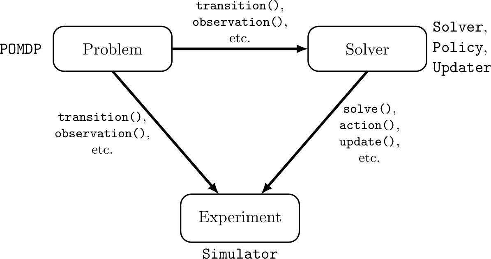

# Concepts and Architecture

POMDPs.jl aims to coordinate the development of three software components: 1) a problem, 2) a solver, 3) an experiment.
Each of these components has a set of abstract types associated with it and a set of functions that allow a user to define each component's behavior in a standardized way.
An outline of the architecture is shown below.

The MDP and POMDP types are associated with the problem definition.
The Solver and Policy types are associated with the solver or decision-making agent.
Typically, the Updater type is also associated with the solver, but a solver may sometimes be used with an updater that was implemented separately.
The Simulator type is associated with the experiment.

## POMDPs and MDPs

An MDP is a mathematical framework for sequential decision making under uncertainty, and where all of the uncertainty arrises from outcomes that are partially random and partially under the control of a decision maker.
Mathematically, an MDP is a tuple (S,A,T,R), where S is the state space, A is the action space, T is a transition function defining the probability of transitioning to each state given the state and action at the previous time, and R is a reward function mapping every possible transition (s,a,s') to a real reward value.
For more information see a textbook such as [1].
In POMDPs.jl an MDP is represented by a concrete subtype of the [`MDP`](@ref) abstract type and a set of methods that define each of its components.
S and A are defined by implementing [`states`](@ref) and [`actions`](@ref) for your specific [`MDP`](@ref) subtype.
T and R are defined by implementing [`transition`](@ref) and [`reward`](@ref).

A POMDP is a more general sequential decision making problem in which the agent is not sure what state they are in.
The state is only partially observable by the decision making agent.
Mathematically, a POMDP is a tuple (S,A,T,R,O,Z) where S, A, T, and R are the same as with MDPs, Z is the agent's observation space, and O defines the probability of receiving each observation at a transition.
In POMDPs.jl, a POMDP is represented by a concrete subtype of the [`POMDP`](@ref) abstract type, `Z` may be defined by the [`observations`](@ref) function (though an explicit definition is often not required), and `O` is defined by implementing[`observation`](@ref) for your specific POMDP type.

POMDPs.jl also contains functions for defining optional problem behavior such as a discount factor or a set of terminal states.

It is important to note that, in some cases, it is difficult to explicitly represent the transition and observation distributions for a problem but it is easy to generate a next state or observation through sampling. In these cases it may be significantly easier to use the [`GenerativeModels.jl`](https://github.com/JuliaPOMDP/GenerativeModels.jl) interface extension *instead of* implementing methods of [`transition`](@ref) and [`observation`](@ref)

## Beliefs and Updaters

In a POMDP domain, the decision-making agent does not have complete information about the state of the problem, so the agent can only make choices based on its "belief" about the state.
In the POMDP literature, the term "belief" is typically defined to mean a probability distribution over all possible states of the system.
However, in practice, the agent often makes decisions based on an incomplete or lossy record of past observations that has a structure much different from a probability distribution.
For example, if the agent is represented by a finite-state controller, as is the case for Monte-Carlo Value Iteration [2], the belief is the controller state, which is a node in a graph.
Another example is an agent represented by a recurrent neural network.
In this case, the agent's belief is the state of the network.
In order to accommodate a wide variety of decision-making approaches in POMDPs.jl, we use the term "belief" to denote the set of information that the agent makes a decision on, which could be an exact state distribution, an action-observation history, a set of weighted particles, or the examples mentioned before.
In code, the belief can be represented by any built-in or user-defined type.

When an action is taken and a new observation is received, the belief is updated by the belief updater.
In code, a belief updater is represented by a concrete subtype of the [`Updater`](@ref) abstract type, and the [`update`](@ref) function defines how the belief is updated when a new observation is received.

Although the agent may use a specialized belief structure to make decisions, the information initially given to the agent about the state of the problem is usually most conveniently represented as a state distribution, thus the [`initialize_belief`](@ref) function is provided to convert a state distribution to a specialized belief structure that an updater can work with.

In many cases, the belief structure is closely related to the solution technique, so it will be implemented by the programmer who writes the solver.
In other cases, the agent can use a variety of belief structures to make decisions, so a domain-specific updater implemented by the programmer that wrote the problem description may be appropriate.
Finally, some advanced generic belief updaters such as particle filters may be implemented by a third party.
The convenience function [`updater`](@ref) can be used to get a suitable default updater for a policy, however many policies can work with other updaters.

## Solvers and Policies

Sequential decision making under uncertainty involves both online and offline calculations.
In the broad sense, the term "solver" as used in the node in the figure at the top of the page refers to the software package that performs the calculations at both of these times.
However, the code is broken up into two pieces, the solver that performs calculations offline and the policy that performs calculations online.

In the abstract, a policy is a mapping from every belief that an agent might take to an action.
A policy is represented in code by a concrete subtype of the [`Policy`](@ref) abstract type.
The programmer implements [`action`](@ref) to describe what computations need to be done online.
For an online solver such as POMCP, all of the decision computation occurs within [`action`](@ref) while for an offline solver like SARSOP, there is very little computation within [`action`](@ref)

The offline portion of the computation is carried out by the solver, which is represented by a concrete subtype of the [`Solver`](@ref) abstract type. Computations occur within the [`solve`](@ref) function.
For an offline solver like SARSOP, nearly all of the decision computation occurs within this function, but for some online solvers such as POMCP, [`solve`](@ref) merely embeds the problem in the policy.

## Simulators

A simulator defines a way to run a single simulation. It is represented by a concrete subtype of the [`Simulator`](@ref) abstract type and the simulation is an implemention of [`simulate`](@ref). [`simulate`](@ref) should return the discounted sum of the stagewise rewards, and the simulator may or may not keep track of the state trajectory or other statistics or display the simulation as it is carried out.

[1] *Decision Making Under Uncertainty: Theory and Application* by Mykel J. Kochenderfer, MIT Press, 2015

[2] Bai, H., Hsu, D., & Lee, W. S. (2014). Integrated perception and planning in the continuous space: A POMDP approach. The International Journal of Robotics Research, 33(9), 1288-1302

