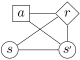

# Dynamic Decision Networks

Part of the conceptual definition of a POMDP or MDP is a dynamic decision network (DDN) that defines which random variables are dependent on each other.
Usually, problem writers will not have to interact directly with the DDN, but it is a helpful concept for understanding, and it can be customized for special problem types.

The standard POMDPs.jl DDN models are shown below:

| Standard MDP DDN | Standard POMDP DDN |
|:---:|:---:|
| |  |

!!! note

    In order to provide additional flexibility, these DDNs have `:s`→`:o`, `:sp`→`:r` and `:o`→`:r` edges that are typically absent from the DDNs traditionally used in the (PO)MDP literature. Traditional (PO)MDP algorithms are compatible with these DDNs because only ``R(s,a)``, the expectation of ``R(s, a, s', o)`` over all ``s'`` and ``o`` is needed to make optimal decisions.

## DDN structure representation

In POMDPs.jl, each DDN node corresponds to a [`Symbol`](https://docs.julialang.org/en/v1/base/base/#Core.Symbol). Often a `p` character (mnemonic: "prime") is appended to denote a new value for the next timestep, e.g. `:sp` represents ``s'``, the state at the next step.

A [`DDNStructure`](@ref) object contains the names of all the nodes, the edges between the nodes, and an object for each node that defines its implementation.

Currently, there are four types of nodes:
- [`DistributionDDNNode`](@ref) to define nodes with stochastic output.
- [`FunctionDDNNode`](@ref) to define a node that is a deterministic function of other nodes.
- [`ConstantDDNNode`](@ref) for a constant.
- [`GenericDDNNode`](@ref) for a node that has no implementation other than [`gen`](@ref) (see [Defining behavior for nodes](@ref) below).

This set is not expected to handle all possible behavior, so new types are likely to be added in the future (and they should be requested when concrete needs are encountered).

## Defining behavior for nodes

For any node in the DDN, the function [`gen`](@ref)`(::DDNNode{:nodename}, m, parent_values..., rng)` will be called to sample a value (see the docstring for more information). This method can always be implemented to provide a generative definition for a node.

Some nodes can alternatively have an explicit implementation. For example, a `DistributionDDNNode` contains a function that is called with the (PO)MDP models and values sampled from the parent nodes to return a distribution. The state transition node, `:sp`, is a particular case of this. If [`gen`](@ref)`(::GenVar{:sp}, m, s, a, rng)` is not defined by the problem writer, `rand(rng, transition(m, s, a))` will be called to generate values for `:sp`.

### Mixing generative and explicit node definitions for a POMDP

POMDP models will often contain a mixture of Generative and explicit definitions, and this is an encouraged paradigm. For example

```julia
using Distributions
struct MyPOMDP <: POMDP{Float64, Float64, Float64} end
POMDPs.gen(::GenVar{:sp}, m::MyPOMDP, s, a, rng) = s+a
POMDPs.observation(::GenVar{:o}, m, s, a, sp, rng) = Normal(sp)
```
would be a suitable distribution for a POMDP that will be solved with particle filtering methods where an explicit observation definition is needed, but a generative state transition definition is sufficient.

!!! note

    It is usually best to *avoid* providing both a generative and explicit definition of *the same node* because it is easy to introduce inconsistency.

## Customizing the DDN

The DDN structure for a particular (PO)MDP problem `type` is defined with the [`DDNStructure`](@ref) trait, which should return a [`DDNStructure`](@ref) object (or something else that implements the appropriate methods). See the docstring for an example.

If a specialized DDN structure is to be compatible with standard POMDP solvers, it should have the standard `:sp`, `:r`, and `:o` nodes.

Currently (as of September, 2019), no solver has special behavior based on the DDN structure, but it is expected that packages will define new DDN structures for specialized cases like constrained POMDPs, mixed observability MDPs, or factored POMDPs. If you are considering creating a solver that relies on a specific DDN structure, please contact the developers so we can coordinate.
