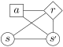
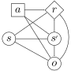

# [Defining (PO)MDP Dynamics](@id dynamics)

The dynamics of a (PO)MDP define how states, observations, and rewards are generated at each time step. One way to visualize the structure of (PO)MDP is with a *dynamic decision network* (DDN) (see for example [*Decision Making under Uncertainty* by Kochenderfer et al.](https://ieeexplore.ieee.org/book/7288640) or [this webpage](https://artint.info/html/ArtInt_229.html) for more discussion of dynamic decision networks).

The POMDPs.jl DDN models are shown below:

| Standard MDP DDN | Standard POMDP DDN |
|:---:|:---:|
| |  |

!!! note

    In order to provide additional flexibility, these DDNs have `:s`→`:o`, `:sp`→`:r` and `:o`→`:r` edges that are typically absent from the DDNs traditionally used in the (PO)MDP literature. Traditional (PO)MDP algorithms are compatible with these DDNs because only ``R(s,a)``, the expectation of ``R(s, a, s', o)`` over all ``s'`` and ``o`` is needed to make optimal decisions.

The task of defining the dynamics of a (PO)MDP consists of defining a model for each of the nodes in the DDN. Models for each node can either be implemented separately through the [`transition`](@ref), [`observation`](@ref), and [`reward`](@ref) functions, or together with the [`gen`](@ref) function. 

## Separate explicit or generative definition

- [`transition`](@ref)`(pomdp, s, a)` defines the state transition probability distribution for state `s` and action `a`. This defines an explicit model for the `:sp` DDN node.
- [`observation`](@ref)`(pomdp, [s,] a, sp)` defines the observation distribution given that action `a` was taken and the state is now `sp` (The observation can optionally depend on `s` - see docstring). This defines an explicit model for the `:o` DDN node.
- [`reward`](@ref)`(pomdp, s, a[, sp[, o]])` defines the reward, which is a deterministic function of the state and action (and optionally `sp` and `o` - see docstring). This defines an explicit model for the `:r` DDN node.

[`transition`](@ref) and [`observation`](@ref) should return distribution objects that implement part or all of the [distribution interface](@ref Distributions). Some predefined distributions can be found in [Distributions.jl](https://github.com/JuliaStats/Distributions.jl) or [POMDPModelTools.jl](https://github.com/JuliaPOMDP/POMDPModelTools.jl), or custom types that represent distributions appropriate for the problem may be created.

!!! note 

    There is no requirement that a problem defined using the explicit interface be discrete; it is straightforward to define continuous POMDPs with the explicit interface, provided that the distributions have some finite parameterization.

## Combined generative definition

If the state, observation, and reward are generated simultaneously, a new method of the [`gen`](@ref) function should be implemented to return the state, observation and reward in a single `NamedTuple`.

### Examples

An example of defining a problem using separate functions can be found at: 
[https://github.com/JuliaPOMDP/POMDPExamples.jl/blob/master/notebooks/Defining-a-POMDP-with-the-Explicit-Interface.ipynb](https://github.com/JuliaPOMDP/POMDPExamples.jl/blob/master/notebooks/Defining-a-POMDP-with-the-Explicit-Interface.ipynb)

An example of defining a problem with a combined `gen` function can be found at:
[https://github.com/JuliaPOMDP/POMDPExamples.jl/blob/master/notebooks/Defining-a-POMDP-with-the-Generative-Interface.ipynb](https://github.com/JuliaPOMDP/POMDPExamples.jl/blob/master/notebooks/Defining-a-POMDP-with-the-Generative-Interface.ipynb)
