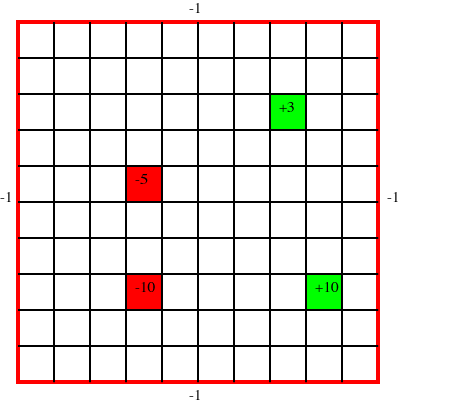

# GridWorld MDP Tutorial

In this tutorial, we provide a simple example of how to define a Markov decision process (MDP) using the POMDPS.jl interface. We will then solve the MDP using value iteration and Monte Carlo tree search (MCTS). We will walk through constructing the MDP using the explicit interface which invovles defining a new type for the MDP and then extending different components of the POMDPs.jl interface for that type.

## Dependencies

We need a few modules in order to run this example. All of the models can be added by running the following command in the Julia REPL:

```julia
using Pkg

Pkg.add("POMDPs")
Pkg.add("POMDPTools")
Pkg.add("DiscreteValueIteration")
Pkg.add("MCTS")
```

If you already had the models installed, it is prudent to update them to the latest version:

```julia
Pkg.update()
```

Now that we have the models installed, we can load them into our workspace:

```@example gridworld_mdp
using POMDPs
using POMDPTools
using DiscreteValueIteration
using MCTS
```

## Problem Overview

In Grid World, we are trying to control an agent who has trouble moving in the desired direction. In our problem, we have four reward states within the a grid. Each position on the grid represents a state, and the positive reward states are terminal (the agent stops recieving reward after reaching them and performing an action from that state). The agent has four actions to choose from: up, down, left, right. The agent moves in the desired direction with a probability of $0.7$, and with a probability of $0.1$ in each of the remaining three directions. If the agent bumps into the outside wall, there is a penalty of $1$ (i.e. reward of $-1$). The problem has the following form:



## Defining the Grid World MDP Type

In POMDPs.jl, an MDP is defined by creating a subtype of the `MDP` abstract type. The types of the states and actions for the MDP are declared as [parameters](https://docs.julialang.org/en/v1/manual/types/#Parametric-Types-1) of the MDP type. For example, if our states and actions are both represented by integers, we can define our MDP type as follows:

```julia
struct MyMDP <: MDP{Int64, Int64} # MDP{StateType, ActionType}
    # fields go here
end
```

In our grid world problem, we will represent the states using a custom type that designates the `x` and `y` coordinate within the grid. The actions will by represented by a symbol.

### GridWorldState
There are numerous ways to represent the state of the agent in a grid world. We will use a custom type that designates the `x` and `y` coordinate within the grid. 

```@example gridworld_mdp
struct GridWorldState
    x::Int64
    y::Int64
end
```

To help us later, let's extend the `==` for our `GridWorldStat`:
    
```@example gridworld_mdp
function Base.:(==)(s1::GridWorldState, s2::GridWorldState)
    return s1.x == s2.x && s1.y == s2.y
end
```

### GridWorld Actions
Since our action is the direction the agent chooses to go (i.e. up, down, left, right), we can use a Symbol to represent it. Note that in this case, we are not defining a custom type for our action, instead we represent it directly with a symbol. Our actions will be `:up`, `:down`, `:left`, and `:right`.

### GridWorldMDP
Now that we have defined our types for states and actions, we can define our MDP type. We will call it `GridWorldMDP` and it will be a subtype of `MDP{GridWorldState, Symbol}`.

```@example gridworld_mdp
struct GridWorldMDP <: MDP{GridWorldState, Symbol}
    size_x::Int64 # x size of the grid
    size_y::Int64 # y size of the grid
    reward_states_values::Dict{GridWorldState, Float64} # Dictionary mapping reward states to their values
    hit_wall_reward::Float64 # reward for hitting a wall
    tprob::Float64 # probability of transitioning to the desired state
    discount_factor::Float64 # disocunt factor
end
```

We can define a constructor for our `GridWorldMDP` to make it easier to create instances of our MDP.

```@example gridworld_mdp
function GridWorldMDP(;
    size_x::Int64=10, 
    size_y::Int64=10, 
    reward_states_values::Dict{GridWorldState, Float64}=Dict(
        GridWorldState(4, 3) => -10.0, 
        GridWorldState(4, 6) => -5.0, 
        GridWorldState(9, 3) => 10.0,
        GridWorldState(8, 8) => 3.0),
    hit_wall_reward::Float64=-1.0,
    tprob::Float64=0.7, 
    discount_factor::Float64=0.9)
    return GridWorldMDP(size_x, size_y, reward_states_values, hit_wall_reward, tprob, discount_factor)
end
```

To help us visualize our MDP, we can extend `show` for our `GridWorldMDP` type:

```@example gridworld_mdp
function Base.show(io::IO, mdp::GridWorldMDP)
    println(io, "Grid World MDP")
    println(io, "\tSize x: $(mdp.size_x)")
    println(io, "\tSize y: $(mdp.size_y)")
    println(io, "\tReward states:")
    for (key, value) in mdp.reward_states_values
        println(io, "\t\t$key => $value")
    end
    println(io, "\tHit wall reward: $(mdp.hit_wall_reward)")
    println(io, "\tTransition probability: $(mdp.tprob)")
    println(io, "\tDiscount: $(mdp.discount_factor)")
end
```

Now lets create an instance of our `GridWorldMDP`:

```@example gridworld_mdp
mdp = GridWorldMDP()

```

!!! note
    In this definition of the problem, our coordiates start in the bottom left of the grid. That is GridState(1, 1) is the bottom left of the grid and GridState(10, 10) would be on the right of the grid with a grid size of 10 by 10.
    
## Grid World State Space
The state space in an MDP represents all the states in the problem. There are two primary functionalities that we want our spaces to support. We want to be able to iterate over the state space (for Value Iteration for example), and sometimes we want to be able to sample form the state space (used in some POMDP solvers). In this notebook, we will only look at iterable state spaces.

Since we can iterate over elements of an array, and our problem is small, we can store all of our states in an array. We also have a terminal state based on the definition of our problem. We can represent that as a location outside of the grid (i.e. `(-1, -1)`).

```@example gridworld_mdp
function POMDPs.states(mdp::GridWorldMDP)
    states_array = GridWorldState[]
    for x in 1:mdp.size_x
        for y in 1:mdp.size_y
            push!(states_array, GridWorldState(x, y))
        end
    end
    push!(states_array, GridWorldState(-1, -1)) # Adding the terminal state
    return states_array
end
```

Let's view some of the states in our state space:

```@example gridworld_mdp
@show states(mdp)[1:5]

```

We also need a other functions related to the state space. 

```@example gridworld_mdp
# Check if a state is the terminal state
POMDPs.isterminal(mdp::GridWorldMDP, s::GridWorldState) = s == GridWorldState(-1, -1)

# Define the initial state distribution (always start in the bottom left)
POMDPs.initialstate(mdp::GridWorldMDP) = Deterministic(GridWorldState(1, 1))

# Function that returns the index of a state in the state space
function POMDPs.stateindex(mdp::GridWorldMDP, s::GridWorldState)
    if isterminal(mdp, s)
        return length(states(mdp))
    end
    
    @assert 1 <= s.x <= mdp.size_x "Invalid state"
    @assert 1 <= s.y <= mdp.size_y "Invalid state"
    
    si = (s.x - 1) * mdp.size_y + s.y
    return si
end

```


### Large State Spaces
If your problem is very large we probably do not want to store all of our states in an array. We can create an iterator using indexing functions to help us out. One way of doing this is to define a function that returns a state from an index and then construct an iterator. This is an example of how we can do that for the Grid World problem. 

!!! note
    If you run this section, you will redefine the `states(::GridWorldMDP)` that we just defined in the previous section.

```@example gridworld_mdp
    
    # Define the length of the state space, number of grid locations plus the terminal state
    Base.length(mdp::GridWorldMDP) = mdp.size_x * mdp.size_y + 1
    
    # `states` now returns the mdp, which we will construct our iterator from
    POMDPs.states(mdp::GridWorldMDP) = mdp
    
    function Base.getindex(mdp::GridWorldMDP, si::Int) # Enables mdp[si]
        @assert si <= length(mdp) "Index out of bounds"
        @assert si > 0  "Index out of bounds"
        
        # First check if we are in the terminal state (which we define as the last state)
        if si == length(mdp)
            return GridWorldState(-1, -1)
        end
        
        # Otherwise, we need to calculate the x and y coordinates
        y = (si - 1) % mdp.size_y + 1
        x = div((si - 1), mdp.size_y) + 1
        return GridWorldState(x, y)
    end
    
    function Base.getindex(mdp::GridWorldMDP, si_range::UnitRange{Int}) # Enables mdp[1:5]
        return [getindex(mdp, si) for si in si_range]
    end

    Base.firstindex(mdp::GridWorldMDP) = 1 # Enables mdp[begin]
    Base.lastindex(mdp::GridWorldMDP) = length(mdp) # Enables mdp[end]

    # We can now construct an iterator
    function Base.iterate(mdp::GridWorldMDP, ii::Int=1)
        if ii > length(mdp)
            return nothing
        end
        s = getindex(mdp, ii)
        return (s, ii + 1)
    end
    
    
```

Similar to above, let's iterate over a few of the states in our state space:

```@example gridworld_mdp
@show states(mdp)[1:5]
@show mdp[begin]
@show mdp[end]

```

## Grid World Action Space
The action space is the set of all actions availiable to the agent. In the grid world problem the action space consists of up, down, left, and right. We can define the action space by implementing a new method of the actions function.

```@example gridworld_mdp
POMDPs.actions(mdp::GridWorldMDP) = [:up, :down, :left, :right]
```

Similar to the state space, we need a function that returns an index given an action.

```@example gridworld_mdp
function POMDPs.actionindex(mdp::GridWorldMDP, a::Symbol)
    @assert in(a, actions(mdp)) "Invalid action"
    return findfirst(x -> x == a, actions(mdp))
end

```

## Grid World Transition Function
MDPs often define the transition function as $T(s^{\prime} \mid s, a)$, which is the probability of transitioning to state $s^{\prime}$ given that we are in state $s$ and take action $a$. For the POMDPs.jl interface, we define the transition function as a distribution over the next states. That is, we want $T(\cdot \mid s, a)$ which is a function that takes in a state and an action and returns a distribution over the next states.

For our grid world example, there are only a few states to which the agent can transition and thus only a few states with nonzero probaility in $T(\cdot \mid s, a)$. We can use the `SparseCat` distribution to represent this. The `SparseCat` distribution is a categorical distribution that only stores the nonzero probabilities. We can define our transition function as follows:

```@example gridworld_mdp
function POMDPs.transition(mdp::GridWorldMDP, s::GridWorldState, a::Symbol)
    # If we are in the terminal state, we stay in the terminal state
    if isterminal(mdp, s)
        return SparseCat([s], [1.0])
    end

    # If we are in a positive reward state, we transition to the terminal state
    if s in keys(mdp.reward_states_values) && mdp.reward_states_values[s] > 0
        return SparseCat([GridWorldState(-1, -1)], [1.0])
    end

    # Probability of going in a direction other than the desired direction
    tprob_other = (1 - mdp.tprob) / 3
    
    new_state_up = GridWorldState(s.x, min(s.y + 1, mdp.size_y))
    new_state_down = GridWorldState(s.x, max(s.y - 1, 1))
    new_state_left = GridWorldState(max(s.x - 1, 1), s.y)
    new_state_right = GridWorldState(min(s.x + 1, mdp.size_x), s.y)
    
    new_state_vector = [new_state_up, new_state_down, new_state_left, new_state_right]
    t_prob_vector = fill(tprob_other, 4)
    
    if a == :up
        t_prob_vector[1] = mdp.tprob
    elseif a == :down
        t_prob_vector[2] = mdp.tprob
    elseif a == :left
        t_prob_vector[3] = mdp.tprob
    elseif a == :right
        t_prob_vector[4] = mdp.tprob
    else
        error("Invalid action")
    end
    
    # Combine probabilities for states that are the same
    for i in 1:4
        for j in (i + 1):4
            if new_state_vector[i] == new_state_vector[j]
                t_prob_vector[i] += t_prob_vector[j]
                t_prob_vector[j] = 0.0
            end
        end
    end
    
    # Remove states with zero probability
    new_state_vector = new_state_vector[t_prob_vector .> 0]
    t_prob_vector = t_prob_vector[t_prob_vector .> 0]
    
    return SparseCat(new_state_vector, t_prob_vector)
end

```

Let's examline a few transitions:

```@example gridworld_mdp
@show transition(mdp, GridWorldState(1, 1), :up)

```

```@example gridworld_mdp
@show transition(mdp, GridWorldState(1, 1), :left)

```

```@example gridworld_mdp
@show transition(mdp, GridWorldState(9, 3), :right)

``` 

```@example gridworld_mdp
@show transition(mdp, GridWorldState(-1, -1), :down)

```

## Grid World Reward Function

In our problem, we have a reward function that depends on the next state as well (i.e. if we hit a wall, we stay in the same state and get a reward of $-1$). We can still construct a reward function that only depends on the current state and action by using expectation over the next state. That is, we can define our reward function as $R(s, a) = \mathbb{E}_{s^{\prime} \sim T(\cdot \mid s, a)}[R(s, a, s^{\prime})]$.

```@example gridworld_mdp
# First, let's define the reward function given the state, action, and next state
function POMDPs.reward(mdp::GridWorldMDP, s::GridWorldState, a::Symbol, sp::GridWorldState)
    # If we are in the terminal state, we get a reward of 0
    if isterminal(mdp, s)
        return 0.0
    end
    
    # If we are in a positive reward state, we get the reward of that state
    # For a positive reward, we transition to the terminal state, so we don't have
    # to worry about the next state (i.g. hitting a wall)
    if s in keys(mdp.reward_states_values) && mdp.reward_states_values[s] > 0
        return mdp.reward_states_values[s]
    end
    
    # If we are in a negative reward state, we get the reward of that state
    # If the negative reward state is on the edge of the grid, we can also be in this state
    # and hit a wall, so we need to check for that
    r = 0.0
    if s in keys(mdp.reward_states_values) && mdp.reward_states_values[s] < 0
        r += mdp.reward_states_values[s]
    end
    
    # If we hit a wall, we get a reward of -1
    if s == sp
        r += mdp.hit_wall_reward
    end
    
    return r
end

# Now we can define the reward function given the state and action
function POMDPs.reward(mdp::GridWorldMDP, s::GridWorldState, a::Symbol)
    r = 0.0
    for (sp, p) in transition(mdp, s, a)
        r += p * reward(mdp, s, a, sp)
    end    
    return r
end

```

Let's examine a few rewards:

```@example gridworld_mdp
@show reward(mdp, GridWorldState(1, 1), :up)

```

```@example gridworld_mdp
@show reward(mdp, GridWorldState(1, 1), :left)

```

```@example gridworld_mdp
@show reward(mdp, GridWorldState(9, 3), :right)

``` 

```@example gridworld_mdp
@show reward(mdp, GridWorldState(-1, -1), :down)

```

```@example gridworld_mdp
@show reward(mdp, GridWorldState(2, 3), :up)

```

## Grid World Remaining Functions
We are almost done! We still need to define `discount`. Let's first use `POMDPLinter` to check if we have defined all the functions we need for DiscreteValueIteration:

```@example gridworld_mdp
using POMDPLinter

@show_requirements POMDPs.solve(ValueIterationSolver(), mdp)

```
As we expected, we need to define `discount`.

```@example gridworld_mdp
function POMDPs.discount(mdp::GridWorldMDP)
    return mdp.discount_factor
end

```

Let's check again:

```@example gridworld_mdp
@show_requirements POMDPs.solve(ValueIterationSolver(), mdp)

```

## Solving the Grid World MDP (Value Iteration)
Now that we have defined our MDP, we can solve it using Value Iteration. We will use the `ValueIterationSolver` from the [DiscreteValueIteration](https://github.com/JuliaPOMDP/DiscreteValueIteration.jl) package. First, we construct the a Solver type which contains the solver parameters. Then we call `POMDPs.solve` to solve the MDP and return a policy.

```@example gridworld_mdp
# Initialize the problem (we have already done this, but just calling it again for completeness in the example)
mdp = GridWorldMDP()

# Initialize the solver with desired parameters
solver = ValueIterationSolver(; max_iterations=100, belres=1e-3, verbose=true)

# Solve for an optimal policy
vi_policy = POMDPs.solve(solver, mdp)
nothing # hide

```

We can now use the policy to compute the optimal action for a given state:

```@example gridworld_mdp
s = GridWorldState(9, 2)
@show action(vi_policy, s)

```

```@example gridworld_mdp
s = GridWorldState(8, 3)
@show action(vi_policy, s)

```

## Solving the Grid World MDP (MCTS)
Similar to the process with Value Iteration, we can solve the MDP using MCTS. We will use the `MCTSSolver` from the [MCTS](https://github.com/JuliaPOMDP/MCTS.jl) package.

```@example gridworld_mdp
# Initialize the problem (we have already done this, but just calling it again for completeness in the example)
mdp = GridWorldMDP()

# Initialize the solver with desired parameters 
solver = MCTSSolver(n_iterations=1000, depth=20, exploration_constant=10.0)

# Now we construct a planner by calling POMDPs.solve. For online planners, the computation for the
# optimal action occurs in the call to `action`.
mcts_planner = POMDPs.solve(solver, mdp)
nothing # hide

```

Similar to the value iteration policy, we can use the policy to compute the action for a given state:

```@example gridworld_mdp
s = GridWorldState(9, 2)
@show action(mcts_planner, s)

```

```@example gridworld_mdp
s = GridWorldState(8, 3)
@show action(mcts_planner, s)

```

## Visualizing the Value Iteration Policy
We can visualize the value iteration policy by plotting the value function and the policy. We can use numerous plotting packages to do this, but we will use [UnicodePlots](https://github.com/JuliaPlots/UnicodePlots.jl) for this example.

```@example gridworld_mdp
using UnicodePlots
using Printf
```

### Value Function as a Heatmap
We can plot the value function as a heatmap. The value function is a function over the state space, so we need to iterate over the state space and store the value at each state. We can use the `value` function to evaluate the value function at a given state.

```@example gridworld_mdp
# Initialize the value function array
value_function = zeros(mdp.size_y, mdp.size_x)

# Iterate over the state space and store the value at each state
for s in states(mdp)
    if isterminal(mdp, s)
        continue
    end
    value_function[s.y, s.x] = value(vi_policy, s)
end

# Plot the value function
heatmap(value_function; 
    title="GridWorld VI Value Function",
    xlabel="x position",
    ylabel="y position",
    colormap=:inferno
)

```

!!! note
    Rendering of unicode plots in the documentation is not optimal. For a better image, run this locally in a REPL.
    
### Visualizing the Value Iteration Policy
One way to visualize the policy is to plot the action that the policy takes at each state. 

```@example gridworld_mdp
# Initialize the policy array
policy_array = fill(:up, mdp.size_x, mdp.size_y)

# Iterate over the state space and store the action at each state
for s in states(mdp)
    if isterminal(mdp, s)
        continue
    end
    policy_array[s.x, s.y] = action(vi_policy, s)
end

# Let's define a mapping from symbols to unicode arrows
arrow_map = Dict(
    :up => " ↑ ",
    :down => " ↓ ",
    :left => " ← ",
    :right => " → "
)

# Plot the policy to the terminal, with the origin in the bottom left
@printf("        GridWorld VI Policy      \n")
for y in mdp.size_y+1:-1:0
    if y == mdp.size_y+1 || y == 0
        for xi in 0:10
            if xi == 0
                print("   ")
            elseif y == mdp.size_y+1
                print("___")
            else
                print("---")
            end
        end
    else
        for x in 0:mdp.size_x+1
            if x == 0
                @printf("%2d |", y)
            elseif x == mdp.size_x + 1
                print("|")
            else
                print(arrow_map[policy_array[x, y]])
            end
        end
    end
    println()
    if y == 0
        for xi in 0:10
            if xi == 0
                print("   ")
            else
                print(" $xi ")
            end
        end
    end
end
```

## Seeing a Policy In Action
Another useful tool is to view the policy in action by creating a gif of a simulation. To accomplish this, we could use [POMDPGifs](https://github.com/JuliaPOMDP/POMDPGifs.jl). To use POMDPGifs, we need to extend the [`POMDPTools.render`](@ref) function to `GridWorldMDP`. Please reference [Gallery of POMDPs.jl Problems](@ref) for examples of this process.