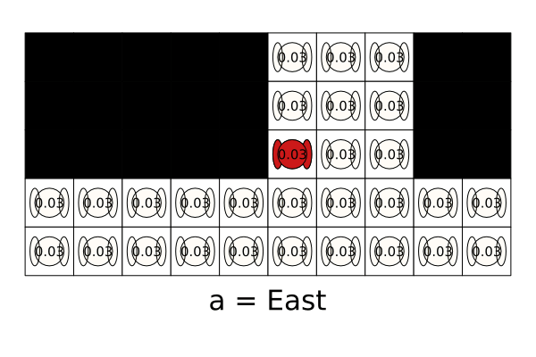

# Gallery of POMDPs.jl Problems
A gallery of models written for [POMDPs.jl](https://github.com/JuliaPOMDP/POMDPs.jl) with visualizations. To view these visualizations on your own machine, the code is provided below each visualization.

## [EscapeRoomba](https://github.com/sisl/AA228FinalProject)
Originally, an optional final project for AA228 at Stanford in Fall 2018. A Roomba equipped with a LIDAR or a bump sensor needs to try to find the safe exit (green) without accidentally falling down the stairs (red).


```@setup EscapeRoomba
using Pkg
Pkg.add(url="https://github.com/sisl/RoombaPOMDPs.git")
```

```@example EscapeRoomba
using POMDPs
using POMDPTools
using POMDPGifs
using BasicPOMCP
using Random
using ParticleFilters
using Cairo
using LinearAlgebra


# If you don't have RoombaPOMDPs installed, uncomment the following two lines
# using Pkg
# Pkg.add(url="https://github.com/sisl/RoombaPOMDPs.git")
using RoombaPOMDPs

# Let's only consider discrete actions
roomba_actions = [RoombaAct(2.0, 0.0), RoombaAct(2.0, 0.7), RoombaAct(2.0, -0.7)]

pomdp = RoombaPOMDP(;
    sensor=Bumper(), 
    mdp=RoombaMDP(; 
        config=2, 
        discount=0.99, 
        contact_pen=-0.1,
        aspace=roomba_actions
    )
)

# Define the belief updater
num_particles = 20000
v_noise_coefficient = 0.0
om_noise_coefficient = 0.4
resampler=LowVarianceResampler(num_particles)
rng = MersenneTwister(1)
belief_updater = RoombaParticleFilter(
    pomdp, num_particles, v_noise_coefficient, 
    om_noise_coefficient,resampler, rng
)

# Custom update function for the particle filter
function POMDPs.update(up::RoombaParticleFilter, b::ParticleCollection, a, o)
    pm = up._particle_memory
    wm = up._weight_memory
    ps = []
    empty!(pm)
    empty!(wm)
    all_terminal = true
    for s in particles(b)
        if !isterminal(up.model, s)
            all_terminal = false
            a_pert = RoombaAct(a.v + (up.v_noise_coeff * (rand(up.rng) - 0.5)), a.omega + (up.om_noise_coeff * (rand(up.rng) - 0.5)))
            sp = @gen(:sp)(up.model, s, a_pert, up.rng)
            weight_sp = pdf(observation(up.model, sp), o)
            if weight_sp > 0.0
                push!(ps, s)
                push!(pm, sp)
                push!(wm, weight_sp)
            end
        end
    end
    
    while length(pm) < up.n_init
        a_pert = RoombaAct(a.v + (up.v_noise_coeff * (rand(up.rng) - 0.5)), a.omega + (up.om_noise_coeff * (rand(up.rng) - 0.5)))
        s = isempty(ps) ? rand(up.rng, b) : rand(up.rng, ps)
        sp = @gen(:sp)(up.model, s, a_pert, up.rng)
        weight_sp = obs_weight(up.model, s, a_pert, sp, o)
        if weight_sp > 0.0
            push!(pm, sp)
            push!(wm, weight_sp)
        end
    end

    # if all particles are terminal, issue an error
    if all_terminal
        error("Particle filter update error: all states in the particle collection were terminal.")
    end
    
    # return ParticleFilters.ParticleCollection(deepcopy(pm))
    return ParticleFilters.resample(up.resampler,
                    WeightedParticleBelief(pm, wm, sum(wm), nothing),
                    up.rng)
end

solver = POMCPSolver(; 
    tree_queries=20000, 
    max_depth=150, 
    c = 10.0,
    rng=MersenneTwister(1)
)

planner = solve(solver, pomdp)

sim = GifSimulator(; 
    filename="examples/EscapeRoomba.gif", 
    max_steps=100, 
    rng=MersenneTwister(3), 
    show_progress=false, 
    fps=5)
saved_gif = simulate(sim, pomdp, planner, belief_updater)

println("gif saved to: $(saved_gif.filename)")
```

```@setup EscapeRoomba
Pkg.rm("RoombaPOMDPs")
```

## [DroneSurveillance](https://github.com/JuliaPOMDP/DroneSurveillance.jl)
Drone surveillance POMDP from M. Svoreňová, M. Chmelík, K. Leahy, H. F. Eniser, K. Chatterjee, I. Černá, C. Belta, "Temporal logic motion planning using POMDPs with parity objectives: case study paper", International Conference on Hybrid Systems: Computation and Control (HSCC), 2015.

In this problem, the UAV must go from one corner to the other while avoiding a ground agent. It can only detect the ground agent within its field of view (in blue).


```@example
using POMDPs
using POMDPTools
using POMDPGifs
using NativeSARSOP
using Random
using DroneSurveillance
import Cairo, Fontconfig

pomdp = DroneSurveillancePOMDP() 
solver = SARSOPSolver(; precision=0.1, max_time=10.0) 
policy = solve(solver, pomdp) 

sim = GifSimulator(; filename="examples/DroneSurveillance.gif", max_steps=30, rng=MersenneTwister(1), show_progress=false)
saved_gif = simulate(sim, pomdp, policy)

println("gif saved to: $(saved_gif.filename)")
```

## [QuickMountainCar](https://github.com/JuliaPOMDP/QuickPOMDPs.jl)
An implementation of the classic Mountain Car RL problem using the QuickPOMDPs interface.


```@example
using POMDPs
using POMDPTools
using POMDPGifs
using Random
using QuickPOMDPs
using Compose
import Cairo

mountaincar = QuickMDP(
    function (s, a, rng)        
        x, v = s
        vp = clamp(v + a*0.001 + cos(3*x)*-0.0025, -0.07, 0.07)
        xp = x + vp
        if xp > 0.5
            r = 100.0
        else
            r = -1.0
        end
        return (sp=(xp, vp), r=r)
    end,
    actions = [-1., 0., 1.],
    initialstate = Deterministic((-0.5, 0.0)),
    discount = 0.95,
    isterminal = s -> s[1] > 0.5,

    render = function (step)
        cx = step.s[1]
        cy = 0.45*sin(3*cx)+0.5
        car = (context(), Compose.circle(cx, cy+0.035, 0.035), fill("blue"))
        track = (context(), line([(x, 0.45*sin(3*x)+0.5) for x in -1.2:0.01:0.6]), Compose.stroke("black"))
        goal = (context(), star(0.5, 1.0, -0.035, 5), fill("gold"), Compose.stroke("black"))
        bg = (context(), Compose.rectangle(), fill("white"))
        ctx = context(0.7, 0.05, 0.6, 0.9, mirror=Mirror(0, 0, 0.5))
        return compose(context(), (ctx, car, track, goal), bg)
    end
)

energize = FunctionPolicy(s->s[2] < 0.0 ? -1.0 : 1.0)
sim = GifSimulator(; filename="examples/QuickMountainCar.gif", max_steps=200, fps=20, rng=MersenneTwister(1), show_progress=false)
saved_gif = simulate(sim, mountaincar, energize)

println("gif saved to: $(saved_gif.filename)")
```

## [RockSample](https://github.com/JuliaPOMDP/RockSample.jl)
The RockSample problem problem from T. Smith, R. Simmons, "Heuristic Search Value Iteration for POMDPs", Association for Uncertainty in Artificial Intelligence (UAI), 2004.

The robot must navigate and sample good rocks (green) and then arrive at an exit area. The robot can only sense the rocks with an imperfect sensor that has performance that depends on the distance to the rock.


```@example
using POMDPs
using POMDPTools
using POMDPGifs
using NativeSARSOP
using Random
using RockSample 
using Cairo 

pomdp = RockSamplePOMDP(rocks_positions=[(2,3), (4,4), (4,2)], 
                        sensor_efficiency=20.0,
                        discount_factor=0.95, 
                        good_rock_reward = 20.0)

solver = SARSOPSolver(precision=1e-3; max_time=10.0)
policy = solve(solver, pomdp)

sim = GifSimulator(; filename="examples/RockSample.gif", max_steps=30, rng=MersenneTwister(1), show_progress=false)
saved_gif = simulate(sim, pomdp, policy)

println("gif saved to: $(saved_gif.filename)")
```

## [TagPOMDPProblem](https://github.com/JuliaPOMDP/TagPOMDPProblem.jl)
The Tag problem from J. Pineau, G. Gordon, and S. Thrun, "Point-based value iteration: An anytime algorithm for POMDPs", International Joint Conference on Artificial Intelligence (IJCAI), 2003.

The orange agent is the pursuer and the red agent is the evader. The pursuer must "tag" the evader by being in the same grid cell as the evader. However, the pursuer can only see the evader if it is in the same grid cell as the evader. The evader moves stochastically "away" from the pursuer.



```@setup TagPOMDP
using Pkg
Pkg.add("Plots")
using Plots
```

```@example TagPOMDP
using POMDPs
using POMDPTools
using POMDPGifs
using NativeSARSOP
using Random
using TagPOMDPProblem

pomdp = TagPOMDP()
solver = SARSOPSolver(; max_time=20.0)
policy = solve(solver, pomdp)
sim = GifSimulator(; filename="examples/TagPOMDP.gif", max_steps=50, rng=MersenneTwister(1), show_progress=false)
saved_gif = simulate(sim, pomdp, policy)

println("gif saved to: $(saved_gif.filename)")
```

```@setup TagPOMDP
using Pkg
Pkg.rm("Plots")
```

## Adding New Gallery Examples
To add new examples, please submit a pull request to the POMDPs.jl repository with changes made to the `gallery.md` file in `docs/src/`. Please include the creation of a gif in the code snippet. The gif should be generated during the creation of the documenation using `@eval` and saved in the `docs/src/examples/` directory. The gif should be named `problem_name.gif` where `problem_name` is the name of the problem. The gif can then be included using ``.