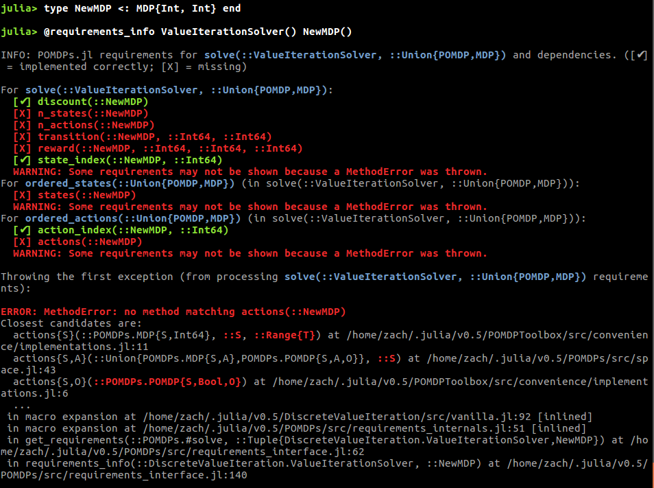
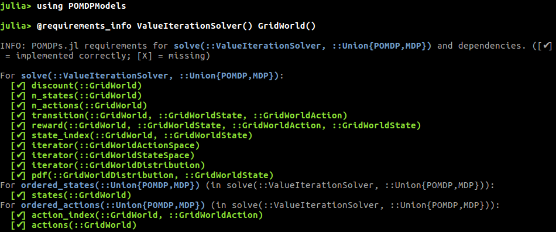

# [Interface Requirements for Problems](@id requirements)

Due to the large variety of problems that can be expressed as MDPs and POMDPs and the wide variety of solution techniques available, there is considerable variation in which of the POMDPs.jl interface functions must be implemented to use each solver. No solver requires all of the functions in the interface, so it is wise to determine which functions are needed before jumping into implementation.

Solvers can communicate these requirements through the `@requirements_info` and `@show_requirements` macros. `@requirements_info` should give an overview of the requirements for a solver, which is supplied as the first argument, the macro can usually be more informative if a problem is specified as the second arg. For example, if you are implementing a new problem `NewMDP` and want to use the `DiscreteValueIteration` solver, you might run the following:



Note that a few of the requirements could not be shown because [`actions`](@ref) is not implemented for the new problem.

If you would like to see a list of all of the requirements for a solver, try running `@requirements_info` with a fully implemented model from `POMDPModels`, for example,



`@show_requirements` is a lower-level tool that can be used to show the requirements for a specific function call, for example
```julia
@show_requirements solve(ValueIterationSolver(), NewMDP())
```
or
```julia
policy = solve(ValueIterationSolver(), GridWorld())
@show_requirements action(policy, GridWorldState(1,1))
```

In some cases, a solver writer may not have specified the requirements, in which case the requirements query macros will output

```
[No requirements specified]
```

In this case, please file an issue on the solver's github page to encourage the solver writer to specify requirements.
